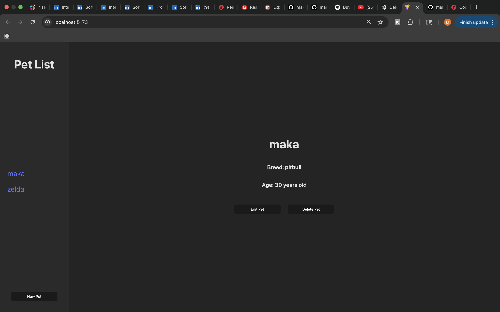
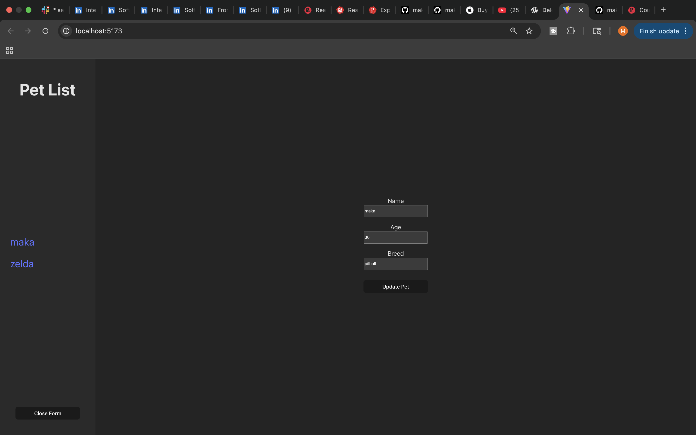

# 🐾 Pet Tracker - Full Stack MERN Application

A full-stack pet management application built with the MERN stack (MongoDB, Express, React, Node.js). This project demonstrates complete CRUD functionality with a React frontend and Express/MongoDB backend, showcasing modern web development practices and RESTful API design.

## 📋 Description

Pet Tracker is a dashboard-style web application that allows users to create, view, update, and delete pet records. The frontend is built with React and Vite, featuring a responsive interface with sidebar navigation, while the backend provides a RESTful API with MongoDB for data persistence.

## 📸 Screenshots

### Dashboard View

*Main dashboard showing pet list and details*

### Add/Edit Pet Form

*Form for creating and updating pet information*

## ✨ Features

- **View All Pets**: Browse through a list of all registered pets
- **Pet Details**: Click on any pet to view detailed information
- **Add New Pets**: Create new pet records with name, breed, and age
- **Edit Pets**: Update existing pet information
- **Delete Pets**: Remove pets from the system
- **Responsive Dashboard Layout**: Clean, modern UI with sidebar navigation
- **Real-time Updates**: Instant UI updates after any CRUD operation

## 🛠️ Technologies Used

### Frontend
- **React** (v19.2.0) - UI library for building component-based interfaces
- **Vite** (v7.2.4) - Fast build tool and development server
- **JavaScript (ES6+)** - Modern JavaScript features
- **CSS3** - Custom styling with grid and flexbox layouts
- **Fetch API** - For making HTTP requests to the backend

### Backend
- **Node.js** - JavaScript runtime
- **Express.js**  - Web application framework
- **MongoDB** - NoSQL database
- **Mongoose**  - MongoDB object modeling
- **CORS**  - Cross-origin resource sharing
- **Morgan**  - HTTP request logger
- **dotenv**  - Environment variable management
- **Nodemon**  - Development server with auto-restart

## 📦 Installation & Setup

### Prerequisites
- Node.js (v14 or higher)
- MongoDB (local installation OR MongoDB Atlas account)
- npm or yarn package manager

### Backend Setup

1. **Clone the backend repository**
   ```bash
   git clone https://github.com/mrmkmtch/express-api-pets-back-end.git
   cd express-api-pets-back-end
   ```

2. **Install dependencies**
   ```bash
   npm install
   ```

3. **Set up MongoDB**
   
   **Option A: MongoDB Atlas (Cloud - Recommended)**
   - Create a free account at [MongoDB Atlas](https://www.mongodb.com/cloud/atlas)
   - Create a new cluster
   - Click "Connect" → "Connect your application"
   - Copy your connection string
   
   **Option B: Local MongoDB**
   - Install MongoDB locally from [mongodb.com](https://www.mongodb.com/try/download/community)
   - Start MongoDB: `mongod`

4. **Set up environment variables**
   
   Create a `.env` file in the root directory:
   
   **For MongoDB Atlas:**
   ```env
   MONGODB_URI=mongodb+srv://<username>:<password>@cluster0.xxxxx.mongodb.net/pets?retryWrites=true&w=majority
   PORT=3000
   ```
   
   **For Local MongoDB:**
   ```env
   MONGODB_URI=mongodb://localhost:27017/pets
   PORT=3000
   ```
   
   ⚠️ **Replace** `<username>` and `<password>` with your MongoDB Atlas credentials

5. **Start the backend server**
   ```bash
   npm run dev
   ```
   
   Backend will run at `http://localhost:3000`

### Frontend Setup

1. **Clone the frontend repository**
   ```bash
   git clone https://github.com/mrmkmtch/react-pets-front-end.git
   cd react-pets-front-end
   ```

2. **Install dependencies**
   ```bash
   npm install
   ```

3. **Set up environment variables**
   
   Create a `.env` file in the root directory:
   ```env
   VITE_BASE_END_SERVER_URL=http://localhost:3000
   ```

4. **Start the development server**
   ```bash
   npm run dev
   ```
   
   Frontend will open at `http://localhost:5173`

## 🔗 API Endpoints

The backend provides the following RESTful endpoints:

| Method | Endpoint      | Description          | Request Body                     |
|--------|---------------|----------------------|----------------------------------|
| GET    | `/pets`       | Get all pets         | None                             |
| GET    | `/pets/:id`   | Get a specific pet   | None                             |
| POST   | `/pets`       | Create a new pet     | `{ name, breed, age }`          |
| PUT    | `/pets/:id`   | Update a pet         | `{ name, breed, age }`          |
| DELETE | `/pets/:id`   | Delete a pet         | None                             |

### Example Request/Response

**Create Pet Request:**
```json
{
  "name": "Buddy",
  "breed": "Golden Retriever",
  "age": 3
}
```

**Response:**
```json
{
  "_id": "65f1234567890abcdef12345",
  "name": "Buddy",
  "breed": "Golden Retriever",
  "age": 3,
  "__v": 0
}
```

## 🚀 Usage

1. **View Pets**: All pets are displayed in the sidebar on the left
2. **Add a Pet**: Click the "New Pet" button to open the form
3. **View Details**: Click on any pet name to see its details
4. **Edit a Pet**: Click the "Edit Pet" button in the details view
5. **Delete a Pet**: Click the "Delete Pet" button to remove a pet

## 📁 Project Structure

### Frontend Structure
```
react-pets-front-end/
├── src/
│   ├── components/
│   │   ├── PetList/         # Displays list of all pets
│   │   ├── PetDetail/       # Shows detailed pet information
│   │   └── PetForm/         # Form for create/update operations
│   ├── services/
│   │   └── petService.js    # API service layer
│   ├── App.jsx              # Main application component
│   ├── App.css              # Application styles
│   └── main.jsx             # Application entry point
├── public/
│   └── screenshots/         # Application screenshots
├── .env                     # Environment variables
└── package.json             # Project dependencies
```

### Backend Structure
```
express-api-pets-back-end/
├── controllers/
│   └── pets.js              # Pet route handlers
├── models/
│   └── pet.js               # Pet Mongoose schema
├── .env                     # Environment variables
├── server.js                # Express server setup
└── package.json             # Project dependencies
```

## 🔗 API Integration

This front-end application requires a backend API server. The service layer (`petService.js`) handles all API calls with full error handling.

**Repository Links:**
- **Frontend**: [https://github.com/mrmkmtch/react-pets-front-end](https://github.com/mrmkmtch/react-pets-front-end)
- **Backend**: [https://github.com/mrmkmtch/express-api-pets-back-end](https://github.com/mrmkmtch/express-api-pets-back-end)

## 🎨 Architecture Highlights

### Frontend Features
- **Component Architecture**: Reusable, modular components with props-based data flow
- **State Management**: React hooks (`useState`, `useEffect`) with centralized state in App component
- **Conditional Rendering**: Different UI states for various user interactions
- **Form Validation**: Required fields with user feedback
- **Responsive Design**: Dashboard layout with sidebar and main content area

### Backend Features
- **MVC Pattern**: Clean separation of concerns (Models, Controllers, Routes)
- **RESTful API**: Standard HTTP methods following REST principles
- **Database Schema**: Mongoose models with validation
- **Middleware Stack**: CORS, JSON parsing, request logging
- **Error Handling**: Comprehensive try-catch blocks with proper responses

## 🌐 Available Scripts

### Frontend
- `npm run dev` - Start development server
- `npm run build` - Build for production
- `npm run preview` - Preview production build
- `npm run lint` - Run ESLint

### Backend
- `npm run dev` - Start server with nodemon (auto-restart)
- `npm start` - Start server in production mode

## 🔮 Future Enhancements

- Add user authentication and authorization (JWT)
- Implement search and filter functionality
- Add pet photos/avatars with image upload
- Include additional pet information (medical records, appointments, vaccinations)
- Add pagination for large pet lists
- Implement sorting options
- Create owner/user profiles
- Add data validation with express-validator
- Implement comprehensive test coverage
- Deploy to cloud platform (Heroku, Vercel, MongoDB Atlas)

## 👤 Author

M'Khel Mitchell

## 📄 License

This project is part of a learning exercise and portfolio demonstration.

---

**Quick Start:**
1. Start MongoDB
2. Run backend: `cd express-api-pets-back-end && npm run dev`
3. Run frontend: `cd react-pets-front-end && npm run dev`
4. Visit `http://localhost:5173`
